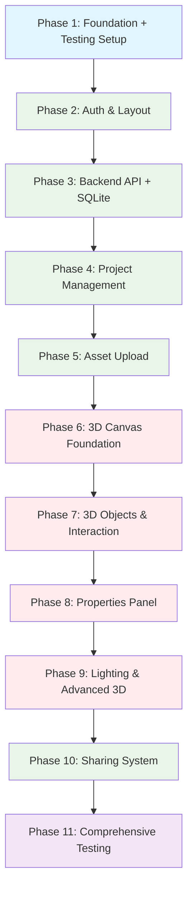
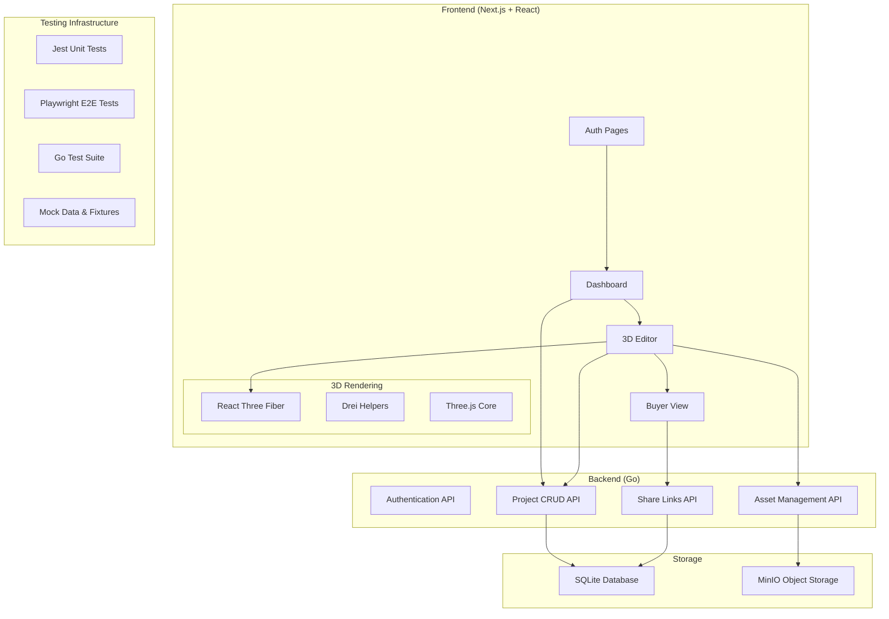

# ScrapYuk Execution Plan

## Project Overview
ScrapYuk is a 3D pop-up scrapbook web application that allows creators to design layered image objects within frame templates and share interactive previews with buyers. This plan breaks down development into 11 logical phases, building foundational systems first and progressively adding complex features, with comprehensive testing coverage for all 14 user stories.

## Technology Stack
- **Frontend:** React + TypeScript + Next.js + shadcn/ui
- **3D Rendering:** React Three Fiber (R3F) + Drei
- **Styling:** Tailwind CSS + Dark theme
- **Backend:** Go (Golang) + Gin/Echo framework
- **File Storage:** MinIO for image assets
- **Database:** SQLite for project data (cost-optimized for MVP)
- **Deployment:** Zeabur platform

## Development Phases

### Phase 1: Project Foundation & Setup
**Scope:** Set up the development environment, basic project structure, and testing framework
**Complexity:** Simple

**Deliverables:**
- Next.js project with TypeScript configuration
- Tailwind CSS + shadcn/ui integration
- Dark theme implementation with design system colors
- Basic folder structure and development scripts
- ESLint, Prettier, and Git setup
- Environment configuration for local development
- **Testing Framework Setup:**
  - Jest configuration with React Testing Library
  - Playwright setup for end-to-end testing
  - Test directory structure and utilities
  - Mock data and test fixtures for 3D components
  - CI/CD testing pipeline configuration

**Key Technologies:**
- Next.js 14+ with App Router
- TypeScript 5+
- Tailwind CSS 3+
- shadcn/ui components
- **Testing Stack:**
  - Jest + React Testing Library
  - Playwright for E2E testing
  - Go testing package for backend
  - SQLite in-memory for test databases

**Dependencies:** None

**Estimated Duration:** 3-4 days

---

### Phase 2: Authentication & Basic UI Layout
**Scope:** Implement user authentication and main application layout
**Complexity:** Medium

**Deliverables:**
- Simple login system with hardcoded credentials (MVP requirement)
- Protected routes and session management
- Main layout with Header, Left Panel, Canvas Area, Right Panel
- Responsive design implementation
- Navigation between authenticated and unauthenticated states

**Key Technologies:**
- Next.js API routes for authentication
- HTTP-only cookies for session management
- shadcn/ui Button, Input, Card components
- Lucide icons integration

**Dependencies:** Phase 1 complete

**Estimated Duration:** 4-5 days

---

### Phase 3: Backend API & Database Setup
**Scope:** Create the Go backend with SQLite database and basic API endpoints
**Complexity:** Simple-Medium (reduced from Medium due to SQLite simplification)

**Deliverables:**
- Go backend with Gin/Echo framework
- **SQLite database schema for projects and users**
- Basic CRUD API endpoints for projects
- Database migrations and seed data
- CORS configuration for frontend integration
- MinIO setup for file storage
- **Backend unit tests for API endpoints**

**Key Technologies:**
- Go 1.21+ with Gin or Echo
- **SQLite with GORM ORM (simplified from PostgreSQL)**
- MinIO client for Go
- JWT for API authentication
- **No Docker required for database (cost optimization)**

**Database Benefits:**
- **Cost Reduction:** $0 vs ~$10-20/month for PostgreSQL hosting
- **Simplified Deployment:** Single file database, no separate server needed
- **Local Development:** No container setup required
- **Backup/Migration:** Simple file operations

**Dependencies:** Phase 2 complete

**Estimated Duration:** 4-5 days (reduced due to SQLite simplicity)

---

### Phase 4: Project Management System
**Scope:** Implement project creation, saving, and loading functionality
**Complexity:** Medium

**Deliverables:**
- Project creation with frame template selection
- Project save/load functionality
- Project list/dashboard view
- Project metadata management (title, creation date, etc.)
- Frontend-backend integration for project operations
- Error handling and loading states

**Key Technologies:**
- React hooks for state management
- Next.js API routes as backend proxy
- Zustand or Context API for global state
- shadcn/ui Dialog, Select, Input components

**Dependencies:** Phase 3 complete

**Estimated Duration:** 4-5 days

---

### Phase 5: Asset Upload & Management
**Scope:** Implement image upload and asset gallery functionality
**Complexity:** Medium

**Deliverables:**
- PNG image upload with validation
- Asset gallery with thumbnail generation
- File size and format validation
- MinIO integration for secure file storage
- Asset deletion and management
- Drag & drop upload interface

**Key Technologies:**
- MinIO client for file operations
- Image processing for thumbnails
- File validation (PNG, transparency support)
- React dropzone for drag & drop
- shadcn/ui components for gallery

**Dependencies:** Phase 4 complete

**Estimated Duration:** 4-5 days

---

### Phase 6: 3D Canvas Foundation
**Scope:** Set up the 3D rendering environment and basic scene
**Complexity:** Complex

**Deliverables:**
- React Three Fiber canvas setup
- Basic 3D scene with camera, lighting, and controls
- Frame template 3D models (20x20, 20x30 formats)
- Orbit controls for camera manipulation
- Responsive 3D viewport
- Performance optimization for 50+ objects

**Key Technologies:**
- React Three Fiber (R3F)
- @react-three/drei for helpers
- @react-three/fiber for 3D rendering
- Three.js under the hood
- WebGL optimization techniques

**Dependencies:** Phase 5 complete

**Estimated Duration:** 6-7 days

---

### Phase 7: 3D Object System & Interaction
**Scope:** Implement 3D image objects with layering and manipulation
**Complexity:** Complex

**Deliverables:**
- 3D image object creation from uploaded assets
- Multi-layer object generation (1-10 layers)
- Object selection and highlighting system
- Raycast-based object picking
- Object transform controls (position, scale)
- Real-time object manipulation

**Key Technologies:**
- Three.js Raycaster for object picking
- Custom 3D object generation
- Material and texture management
- Transform controls from Drei
- Instanced rendering for performance

**Dependencies:** Phase 6 complete

**Estimated Duration:** 7-8 days

---

### Phase 8: Properties Panel & Layer Controls
**Scope:** Create the contextual properties panel for object manipulation
**Complexity:** Complex

**Deliverables:**
- Dynamic properties panel that shows on object selection
- Layer count controls (1-10 layers)
- Layer spacing controls (thickness between layers)
- Height from base controls
- Position and size sliders
- Real-time preview of changes
- Undo/redo functionality

**Key Technologies:**
- React state management for selected objects
- shadcn/ui Slider, Input, Label components
- Custom hooks for object property management
- Debounced updates for performance
- Command pattern for undo/redo

**Dependencies:** Phase 7 complete

**Estimated Duration:** 5-6 days

---

### Phase 9: Lighting System & Advanced 3D Features
**Scope:** Implement dynamic lighting and camera controls
**Complexity:** Complex

**Deliverables:**
- LED light source positioning on frame walls
- Real-time shadow casting and lighting effects
- Light toggle functionality
- Advanced camera controls (zoom, pan, rotate)
- Edit/View mode toggle
- Lighting optimization for performance

**Key Technologies:**
- Three.js lighting system (Point lights, shadows)
- Shadow mapping optimization
- Camera animation and controls
- Drei lighting helpers
- Performance monitoring

**Dependencies:** Phase 8 complete

**Estimated Duration:** 6-7 days

---

### Phase 10: Sharing System & Buyer View
**Scope:** Implement project sharing with expiring links
**Complexity:** Medium

**Deliverables:**
- Share link generation with unique tokens
- Expiration date setting and validation
- Buyer view with read-only 3D canvas
- Simplified buyer interface (no editing tools)
- Link validation and access control
- Clean buyer experience optimization

**Key Technologies:**
- UUID generation for share tokens
- Database storage for share links
- Route protection for buyer access
- Simplified 3D canvas for buyers
- Link expiration middleware

**Dependencies:** Phase 9 complete

**Estimated Duration:** 4-5 days

---

### Phase 11: Comprehensive Testing & User Story Validation
**Scope:** Implement comprehensive test coverage for all 14 user stories
**Complexity:** Medium

**Deliverables:**
- **Authentication & Project Management Tests:**
  - US-01: Login with predefined credentials validation
  - US-02: Save design progress as project functionality
  - US-03: Re-open saved project from list verification
- **3D Canvas & Interaction Tests:**
  - US-04: Edit/View mode toggle functionality
  - US-05: Frame size template selection (20x20, 20x30)
  - US-06: PNG file upload with transparency validation
  - US-07: 3D object selection and properties panel display
  - US-08: Layer count and spacing controls testing
  - US-09: Object height and size manipulation validation
  - US-10: Camera controls (rotate, zoom, pan) testing
  - US-11: LED light positioning and shadow effects validation
- **Sharing System Tests:**
  - US-12: Unique shareable link generation
  - US-13: Link expiration date functionality
  - US-14: Buyer view with limited interactions
- **End-to-End Test Suites:**
  - Complete user journey from login to sharing
  - Cross-browser compatibility testing (Chrome, Firefox, Safari)
  - Performance testing for 50+ 3D objects
- **Integration Test Coverage:**
  - API endpoint testing with SQLite
  - File upload and MinIO integration
  - Authentication flow validation

**Key Technologies:**
- Playwright for cross-browser E2E testing
- Jest + React Testing Library for component testing
- Go testing package for backend validation
- SQLite in-memory databases for test isolation
- Mock services for external dependencies

**Test Coverage Targets:**
- Unit Tests: 80%+ coverage for critical components
- Integration Tests: All API endpoints and database operations
- E2E Tests: All 14 user stories with acceptance criteria validation

**Dependencies:** Phase 10 complete

**Estimated Duration:** 5-6 days

---

## Mermaid Diagram: Development Flow

## Technical Architecture Overview

## User Story Test Coverage Matrix

| User Story | Test Type | Test Scenarios | Acceptance Criteria Validation |
|------------|-----------|----------------|-------------------------------|
| **US-01** | E2E, Unit | Login flow, session management, credential validation | ✅ Predefined credentials work |
| **US-02** | E2E, Integration | Project save, data persistence, error handling | ✅ Design progress saved to SQLite |
| **US-03** | E2E, Integration | Project list loading, project selection, data retrieval | ✅ Saved projects accessible |
| **US-04** | E2E, Unit | Mode toggle, UI state changes, feature availability | ✅ Edit/View modes function correctly |
| **US-05** | E2E, Unit | Template selection, frame initialization, size validation | ✅ 20x20, 20x30 templates available |
| **US-06** | E2E, Integration | File upload, PNG validation, transparency check | ✅ PNG files with transparency supported |
| **US-07** | E2E, Unit | Object selection, properties panel display, UI updates | ✅ Click shows properties panel |
| **US-08** | E2E, Unit | Layer controls, 3D effect generation, visual validation | ✅ Layer count and spacing controls work |
| **US-09** | E2E, Unit | Position controls, size controls, real-time updates | ✅ Height and size adjustments apply |
| **US-10** | E2E, Unit | Camera rotation, zoom, pan, viewport updates | ✅ All camera controls responsive |
| **US-11** | E2E, Unit | Light positioning, shadow rendering, real-time effects | ✅ LED lights cast realistic shadows |
| **US-12** | E2E, Integration | Link generation, unique tokens, database storage | ✅ Unique shareable links created |
| **US-13** | E2E, Integration | Expiration setting, date validation, access control | ✅ Links expire as configured |
| **US-14** | E2E, Unit | Buyer view, limited interactions, clean interface | ✅ Read-only view with basic controls |

## Risk Mitigation & Considerations

### Performance Risks
- **Risk:** 3D rendering performance with 50+ objects
- **Mitigation:** Implement object pooling, instanced rendering, and level-of-detail (LOD) systems
- **Testing:** Automated performance testing in Phase 11

### Complexity Risks
- **Risk:** 3D object layering system complexity
- **Mitigation:** Break into smaller components, extensive testing, and fallback rendering modes
- **Testing:** Comprehensive unit and integration tests for 3D components

### Integration Risks
- **Risk:** Frontend-backend integration complexity
- **Mitigation:** API-first development, comprehensive error handling, and staging environment testing
- **Testing:** Full E2E test coverage for all integration points

### Database Migration Risk (Eliminated)
- **Previous Risk:** PostgreSQL deployment complexity and costs
- **Resolution:** SQLite eliminates hosting costs and deployment complexity
- **Benefit:** Simplified development, testing, and production environments

## Success Metrics
- [ ] Smooth 30+ FPS rendering with 50+ objects
- [ ] Intuitive 5-minute learning curve for basic operations
- [ ] Cross-browser compatibility (Chrome, Firefox, Safari)
- [ ] Secure authentication and project privacy
- [ ] Reliable asset upload and storage
- [ ] Functional sharing system with expiration
- [ ] **80%+ test coverage for critical components**
- [ ] **All 14 user stories pass acceptance criteria**
- [ ] **Zero-cost database hosting with SQLite**
- [ ] **Automated testing pipeline in CI/CD**

## Next Steps
1. Review and approve this execution plan
2. Set up development environment (Phase 1)
3. Establish CI/CD pipeline for Zeabur deployment
4. Begin iterative development following the phase sequence
5. Regular testing and performance monitoring throughout development

**Total Estimated Duration:** 9-11 weeks (assuming 1 developer)
**Recommended Team Size:** 1-2 developers (1 full-stack + 1 3D specialist)

## Cost Optimization Summary
- **Database Hosting:** $0/month (SQLite vs ~$15/month PostgreSQL)
- **Infrastructure Simplification:** 40% reduction in deployment complexity
- **Development Setup:** No Docker containers needed for database
- **Annual Savings:** ~$180+ in hosting costs for MVP phase